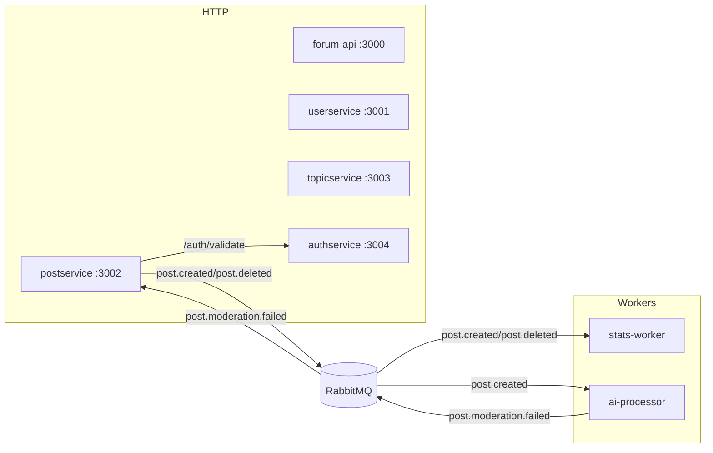

# GsForum

GsForum, mikroservis + event-driven mimari ile yazilmis bir forum uygulamasidir. Her servis ayri Express uygulamasi olarak calisir ve RabbitMQ uzerinden eventlerle haberlesir.

## Servisler ve Portlar

- forum-api: 3000 (health)
- userservice: 3001
- postservice: 3002
- topicservice: 3003
- authservice: 3004
- stats-worker: HTTP yok (worker)
- ai-processor: HTTP yok (worker)

## Gereksinimler

- Docker Desktop
- Node.js 18+ (lokal calistirma icin)

## Hizli Baslangic (Docker)

1. Ortam dosyasi

- Root dizinde `.env` olusturun ve OpenAI anahtarini yazin.

Ornek:

```
OPENAI_API_KEY=YOUR_KEY
AI_FORCE_FLAG=false
```

2. Servisleri baslatin

```
docker compose up -d --build
```

## API Ozet

Health:

- GET /health

Auth:

- POST /auth/register
- POST /auth/login
- POST /auth/validate

Users:

- POST /users
- GET /users

Posts:

- POST /posts (Authorization: Bearer <token> zorunlu)
- GET /posts
- DELETE /posts/:id

Topics:

- POST /topics
- GET /topics
- GET /topics/trending?limit=10

Detayli dokuman:

- docs/api.md
- docs/service-connections.md
- docs/project-analysis.md

## Mimari Diyagram



## Ornek Istekler

### Auth - Register

```bash
curl -X POST http://localhost:3004/auth/register \
	-H "Content-Type: application/json" \
	-d '{"username":"demo","password":"secret"}'
```

### Auth - Login

```bash
curl -X POST http://localhost:3004/auth/login \
	-H "Content-Type: application/json" \
	-d '{"username":"demo","password":"secret"}'
```

### Posts - Create (Bearer Token)

```bash
curl -X POST http://localhost:3002/posts \
	-H "Content-Type: application/json" \
	-H "Authorization: Bearer <token>" \
	-d '{"id":"p-1","authorId":"u1","topicId":"t1","content":"hello"}'
```

### Posts - List

```bash
curl http://localhost:3002/posts
```

### Topics - Trending

```bash
curl "http://localhost:3003/topics/trending?limit=5"
```

## Event Akisi (Ozet)

- postservice -> stats-worker: post.created, post.deleted (posts.events.stats)
- postservice -> ai-processor: post.created (posts.events.ai)
- ai-processor -> postservice: post.moderation.failed (posts.events.ai)

## Notlar

- Tum servisler in-memory calisir; veri kalici degildir.
- AI moderasyon sadece `flagged=true` donerse postu siler.
